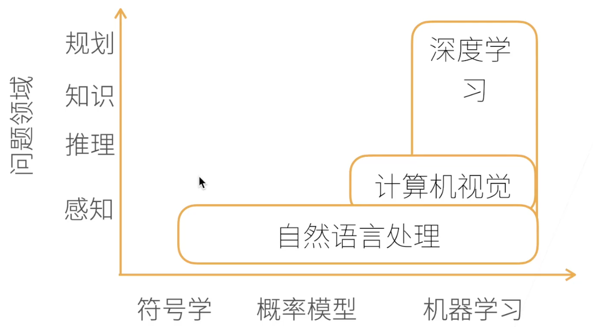

# AI 地图

过去最热门的方向是计算机视觉以及自然语言处理

# DL应用领域
## 图片分类
10-17年,从12年开始,DL在图片分类领域把误差降到非常低了,在17年已经降到5%以内了
## 物体检测和分割
- 检测: 物体出现在什么地方
- 分割: 这个像素点属于什么物体
## 样式迁移
把图片内容换成任意样式的风格
## 人脸合成
随机合成人脸照片
## 文字生成图片
文生图,也是非常热门的方向
## 文字生成
GPT等,当前最热门的DL方向
## 无人驾驶

对于DL来说,模型是一个黑盒,其可解释性非常差,但是效果却很好

# 学习目标
为什么 MLP 能学习？
为什么需要 activation？
为什么 backprop 能工作？
为什么 CNN 对图像有效？
为什么 RNN 有 vanishing gradient？
为什么 LSTM 能缓解？
为什么 Attention 有用？
为什么 Transformer 可以并行？
为什么 LayerNorm 而不是 BatchNorm？
为什么 Self-Attention 的复杂度是 O(n²)？
